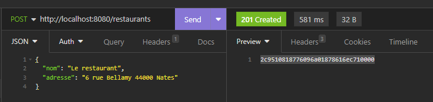
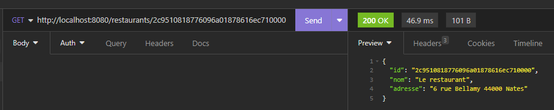
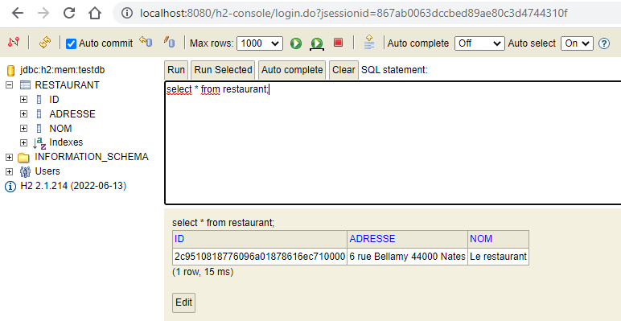

# Restaurant-app
<<<<<<< HEAD
## POST

## Get with Post id

## Post h2 vérification

=======
## HATEOAS link restaurants

## HATEOAS link to a restaurant

## HATEOAS link to a menu of a restaurant

>>>>>>> origin/RESTO-17
