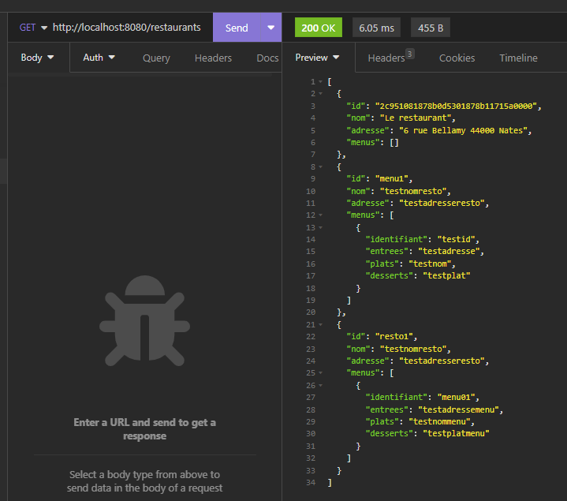
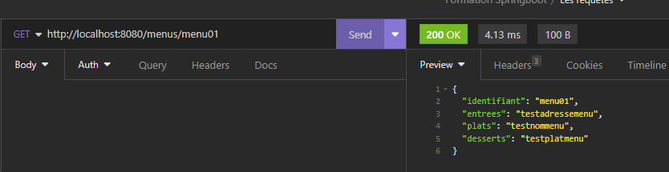

# Restaurant-app
## Get restaurants

# Get menus

# Get list menus of a restaurant

# Get menus of one restaurant

# Requêtes SQL H2 DB
INSERT INTO MENUS(IDENTIFIANT,ENTREES, PLATS, DESSERTS)VALUES('menu01','testadressemenu', 'testnommenu', 'testplatmenu');
INSERT INTO RESTAURANT_MENUS (RESTAURANT_ID , MENUS_IDENTIFIANT)VALUES('resto1','menu01');
INSERT INTO RESTAURANT (ID, ADRESSE, NOM)VALUES('resto1', 'testadresseresto', 'testnomresto');
